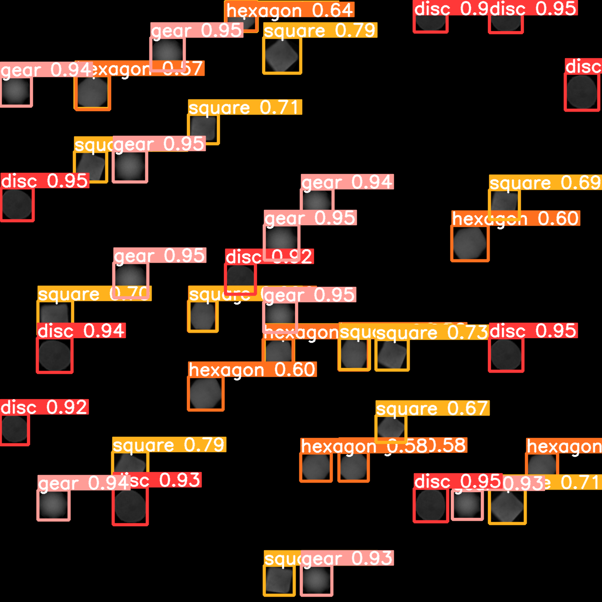

# Cell Detection Project

This project aims to detect and classify cells in images, utilizing state-of-the-art object detection techniques. The project is divided into various parts, each contributing to the overall goal of fast and accurate cell detection.

## ➡️ Part 1: Image Preprocessing

**Image Creation**:
*Size*: We create a background image of size MxM, like 1024x1024.  
Pasting Input Images: The input images of cells are pasted onto this background.   
Scaling: Images are scaled by a factor of 0.75 to 0.95 to introduce variability in size.   
*Rotation*: Images are randomly rotated between 0 to 90 degrees to enhance orientation diversity.  

**Reasoning**:
>*Random Placement*: Randomly placing images on the background using the random() function increases the model's robustness to varying object locations.  
*Ground Truth Labeling*: By saving the coordinates of the centroid, width, and height of the placed images, we generate ground truth labels for training the detection model.

## ➡️ Part 2: Model Training

### Data Splitting:
- **Ratio**: The dataset is divided into training, validation, and test sets in the ratio of 80:10:10.

### Model Selection: YOLOv5
- **Why YOLOv5**: Chosen for its state-of-the-art results at low latency, crucial for fast inference.
- **Training**: The model is trained using a .yaml file generated with the required configurations.

### Alternative Models Considered:
- **Faster RCNN**: Using weights from Resnet50 (without final layers).
- **Simple CNN**: A basic convolutional neural network.
- **Reasoning**: Although these models are viable, YOLOv5 provides the best balance of speed and accuracy for multiclass classification.

>Part 3: API Endpoint and Docker (Optional)
FastAPI:
- **API Endpoint**: If time permits, an API endpoint will be created using FastAPI to provide access to the model.
Docker:
- **Containerization**: A Docker file may be created for easy deployment and scaling.
---
```diff
+ ➡️ Sample run on Test Image
```


---
## ➡️ Conclusion

This project demonstrates a comprehensive approach to cell detection, from preprocessing and augmentation to model selection and potential deployment. The choice of techniques and methodologies is driven by the need for accurate multiclass classification and fast object detection.
 

 
 


